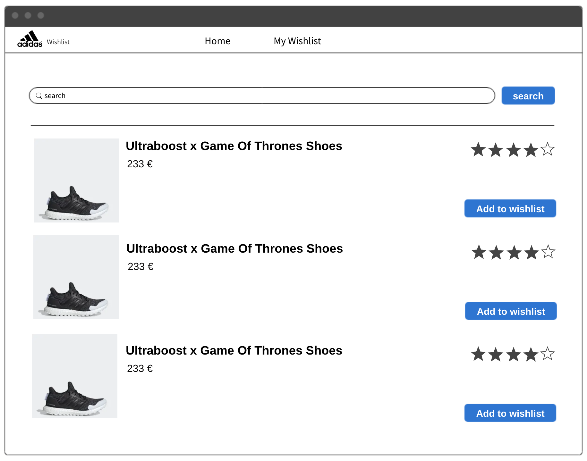
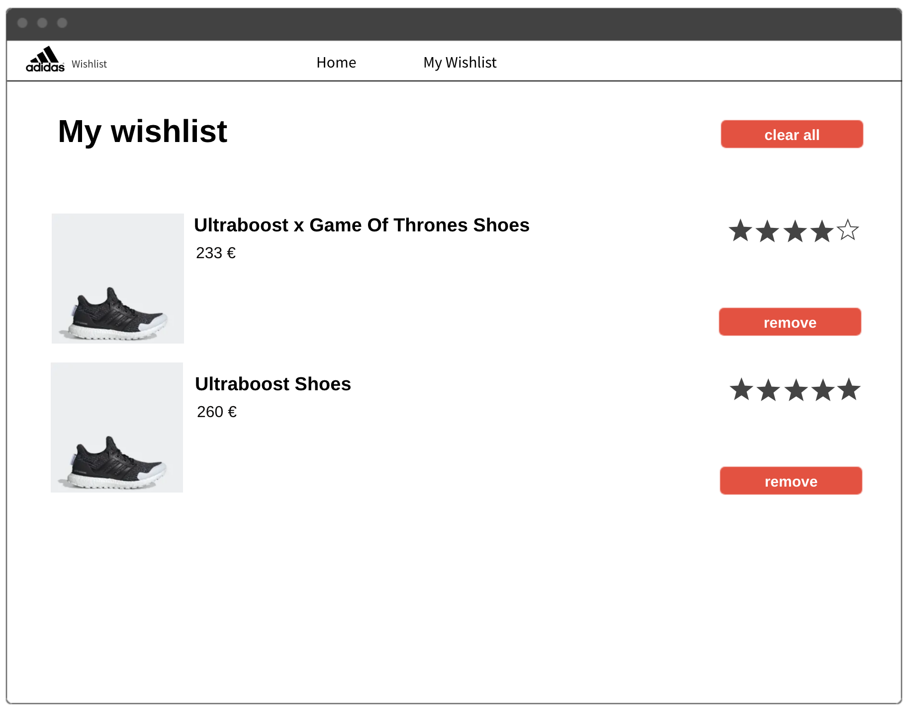

# Wishlist app
Wishlist App for the adidas code challenge.


## Frontend

### Run the application

```
make app-run
```
will also run the API as docker dependency, the API will listen in port 8085, and the react app on port 3000
open http://localhost:3000/ to test.


### Run the tests

```
make frontend-tests
```

## The API

### How to run locally

#### With docker

requires [docker](https://docs.docker.com/install/) and [docker-compose](https://docs.docker.com/compose/install/).

```
make api-run
```

You can access the swagger ui by openning this URL: http://localhost:8085/ui/


#### Without docker (macos)

requires [`brew`](https://brew.sh) and [`python 3.6`](https://www.python.org/downloads/)

```
brew install pipenv
cd api
pipenv shell
pipenv install
./app.py
```


### How to run linting

```
make api-lint
```

### How to run unit tests

```
make api-utests 
```

### How to run integration tests

```
make api-itests
```

### Build the api image

```
make api-build
```


A hosted version is also available an deployed here: [TBD]()

## Steps used to build the project

### Step 1 (Mookups)

I've started first to draw project mookups, this is the first step in order to validate the feature with differents users.

The application provides two screens 

#### Home/Search products



##### User stories:

1. As an adidas user I can search any product
2. As an adidas user I can add a specific product to my wishlist


#### My Wishlist



##### User stories:

1. As an adidas user I can list my wishlist
2. As an adidas user I can delete a product from my wishlist
3. (Optional) As an adidas user I can clear my wishlist

### Step 2 (REST API Design)

Once the mookups are defined, I started to define the REST API by writing the swagger V2 specification.

The swagger is available at `api/swagger.yaml` and hosted as well in swaggerhub https://app.swaggerhub.com/apis-docs/koukama/Wishlist/1.0.0#/Wishlist

This approch allow :
1. Parallel developement of the client and the backend.
2. Quick Validation the API with the clients.

### Step 3 (API implementation)

In order the speedup and to provide the first MVP, i decided to go for [connexion](https://github.com/zalando/connexion) which is a Swagger/OpenAPI First framework for Python on top of Flask with automatic endpoint validation.

One of the feature I like with this framework is the provided Web Swagger Console UI so that the users of the API can have live documentation and even call API's endpoints through it.


### Step 4 (FrontEnd)

This step can be done in parallel with Step 3 thanks the the API prototype.
To build the frontend I used React, and build the MVP with[`create-react-app`](https://github.com/facebook/create-react-app) cli tool.

Some basic tests are also available and written using Jest as a test runner and [Enzyme](https://airbnb.io/enzyme/).


## TO DO
- [x] Mookups
- [x] API description in swagger
- [x] Basic API implementation
- [x] Dockerization of the API
- [x] Makefile
- [x] Tests for the API including unit and integration
- [x] Front end with React
- [x] Basic CSS with bootstrap
- [x] Documentation

## List of improvements
- [ ] Add pagination to the wishlist page
- [ ] Login implementation
- [ ] Add Redux
- [ ] CSS improvements
- [ ] DB storage for the API
- [ ] Push image to docker registry after the build
- [ ] CI/CD implementation
- [ ] Deploy in the cloud

